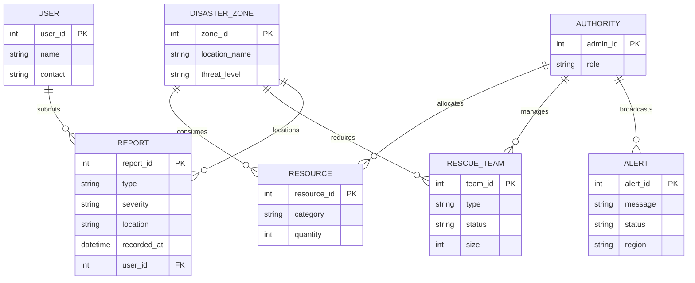
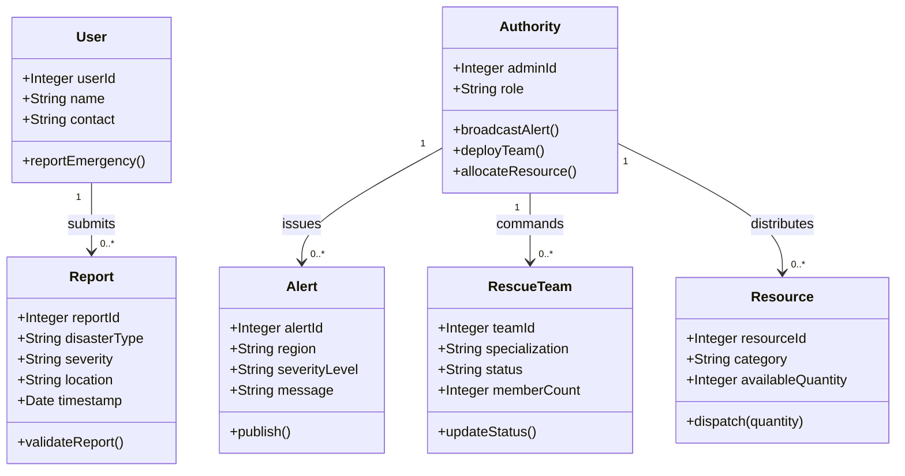

# System Diagrams
## Disaster Management and Emergency Response System

### 1. Entity-Relationship (ER) Diagram

```mermaid
erDiagram
    USER ||--o{ REPORT : submits
    AUTHORITY ||--o{ ALERT : broadcasts
    AUTHORITY ||--o{ RESCUE_TEAM : manages
    AUTHORITY ||--o{ RESOURCE : allocates
    DISASTER_ZONE ||--o{ REPORT : locations
    DISASTER_ZONE ||--o{ RESCUE_TEAM : requires
    DISASTER_ZONE ||--o{ RESOURCE : consumes

    USER {
        int user_id PK
        string name
        string contact
    }
    
    REPORT {
        int report_id PK
        string type
        string severity
        string location
        datetime recorded_at
        int user_id FK
    }

    AUTHORITY {
        int admin_id PK
        string role
    }

    ALERT {
        int alert_id PK
        string message
        string status
        string region
    }

    RESCUE_TEAM {
        int team_id PK
        string type
        string status
        int size
    }

    RESOURCE {
        int resource_id PK
        string category
        int quantity
    }
    
    DISASTER_ZONE {
        int zone_id PK
        string location_name
        string threat_level
    }
```

---

### 2. Class Diagram

```mermaid
classDiagram
    class User {
        +Integer userId
        +String name
        +String contact
        +reportEmergency()
    }

    class Authority {
        +Integer adminId
        +String role
        +broadcastAlert()
        +deployTeam()
        +allocateResource()
    }

    class Report {
        +Integer reportId
        +String disasterType
        +String severity
        +String location
        +Date timestamp
        +validateReport()
    }

    class RescueTeam {
        +Integer teamId
        +String specialization
        +String status
        +Integer memberCount
        +updateStatus()
    }

    class Resource {
        +Integer resourceId
        +String category
        +Integer availableQuantity
        +dispatch(quantity)
    }

    class Alert {
        +Integer alertId
        +String region
        +String severityLevel
        +String message
        +publish()
    }

    User "1" --> "0..*" Report : submits
    Authority "1" --> "0..*" Alert : issues
    Authority "1" --> "0..*" RescueTeam : commands
    Authority "1" --> "0..*" Resource : distributes
```
