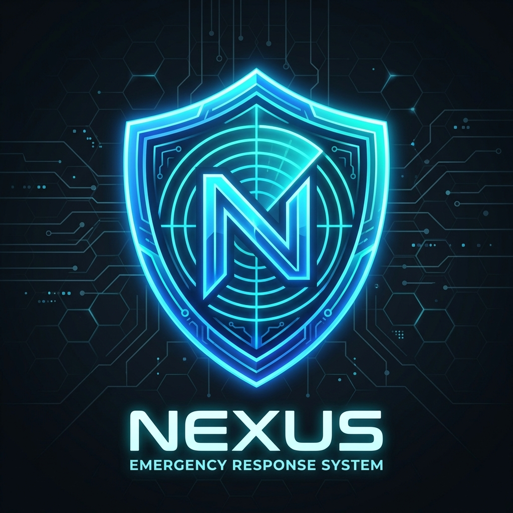

# 🌌 Nexus | Centralized Disaster Management & Emergency Response System

<p align="center">
  
</p>

[](https://html.spec.whatwg.org/)
[](https://www.w3.org/Style/CSS/)
[](https://developer.mozilla.org/en-US/docs/Web/JavaScript)
[](https://opensource.org/licenses/MIT)

Nexus is a state-of-the-art, real-time command dashboard designed to coordinate emergency response efforts, track critical rescue operations, manage vital resource inventories, and broadcast public safety alerts. It features a high-performance, dark-mode **Glassmorphism** layout designed for stressful command-center environments.

---

## 🧭 System Overview & Architecture

Nexus enforces role-based workflows to separate high-level operations management from field reporting. It is structured into two main access levels:

```
[ Authentication Gateway ]
           │
           ├──► Admin (Access ID: admin) ──► Complete Command Dashboard (KPIs, Map, Registry, Dispatcher)
           │
           └──► Reporter (Access ID: reporter) ─► Streamlined Incident Logging & Emergency Warnings
```

---

## 🚀 Core Features

### 📡 1. Command & Control Center
*   **Tactical KPI Gauges**: Real-time metrics charting Active Emergencies, Deployed Rescue Crews, Active Public Warnings, and Total Dispatched Resources.
*   **Simulated Radar Tracking Map**: An interactive navigation map featuring a rotating radar sweep animation and blinking neon distress beacons mapping active disaster locations.
*   **Real-time Operations Logging**: Dynamic syncing of incident reports from field reporters immediately into the Commander's dispatch log.

### 🛡️ 2. Role-Based Access Control (RBAC)
*   **Access ID Verification**: Restricts features using local Javascript validation.
*   **Stateful Sessions**: Ability to securely terminate operations (`Terminate Session`) and return to the login gateway.
*   **Dynamic Sidebar Filtering**: System interface elements dynamically hide/show depending on the clearance level of the logged-in credentials.

### 🚒 3. Resource & Fleet Management
*   **Resource Dispatch Protocol**: Allows commanders to requisition and authorize the dispatch of Trauma Kits, Potable Water, MRE Rations, and Heavy Equipment. System automatically tracks inventory and raises alerts if levels are depleted.
*   **Rescue Team Registry**: Direct tracking of rescue fleets, highlighting Pax numbers, specialized tasks (e.g., Water Rescue, Heavy Search), and deployment statuses.

---

## 📁 Repository Structure

The project follows a standard, modular workspace hierarchy:

```
📁 disaster_system/
│
├── 📁 assets/                          # Static Frontend Resources
│   ├── 📁 css/
│   │   └── style.css                   # Space-Cyber Glassmorphism Styles & Animations
│   └── 📁 js/
│       └── app.js                      # Authentication, State Engine & Form Actions
│
├── 📁 docs/                            # System Engineering Documentation
│   ├── Diagrams.md                     # Database ER & Class Diagrams
│   ├── Maintenance_Plan.md             # Project maintenance strategies
│   ├── SRS.md                          # System Requirements Specification
│   └── Test_Cases.md                   # Quality assurance validation protocols
│
├── index.html                          # Entry Point Layout
└── README.md                           # Main Documentation Portal
```

---

## ⚙️ Local Installation & Setup

### Prerequisites
*   A modern web browser (Chrome, Safari, Firefox, or Edge).
*   Python 3.x (to run a local development server for hosting assets and avoiding file security policies).

### Execution Steps
1.  **Clone the Repository**:
    ```bash
    git clone https://github.com/Himanshu-Singh11/Disaster_System.git
    cd Disaster_System
    ```

2.  **Initialize the Web Server**:
    Using Python's built-in module:
    ```bash
    python3 -m http.server 8000
    ```

3.  **Launch the Dashboard**:
    Open your browser and navigate to **`http://localhost:8000`**.

---

## 🔐 Credentials for Testing

Use the credentials below at the login screen to evaluate both dashboard perspectives:

| Role Permission | Access ID | Authorization Code | Interface Access |
| :--- | :--- | :--- | :--- |
| **System Commander** | `admin` | `admin123` | Full Dashboard, Map, Teams & Resource panels. |
| **Field Reporter** | `reporter` | `rep123` | Report Hub, Public Warnings panel. |

---

## ⚖️ License
Distributed under the MIT License. See [LICENSE](LICENSE) (or the repository info) for details.
